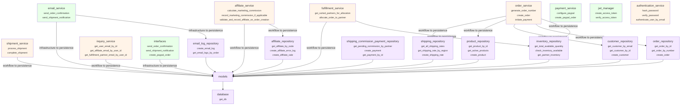

# Level 3: Detailed Architecture

생성일: 2025-12-06 12:20:55

```mermaid
graph TB
    workflow_services_order_service_py["order_service<br/><sub>generate_order_number<br/>create_order<br/>initiate_payment</sub>"]
    workflow_services_fulfillment_service_py["fulfillment_service<br/><sub>get_sorted_partners_for_allocation<br/>allocate_order_to_partner</sub>"]
    workflow_services_shipment_service_py["shipment_service<br/><sub>process_shipment<br/>complete_shipment</sub>"]
    infrastructure_external_services_email_service_py["email_service<br/><sub>send_order_confirmation<br/>send_shipment_notification</sub>"]
    workflow_services_affiliate_service_py["affiliate_service<br/><sub>calculate_marketing_commission<br/>record_marketing_commission_if_applicable<br/>validate_and_record_affiliate_on_order_creation</sub>"]
    infrastructure_external_services_payment_service_py["payment_service<br/><sub>configure_paypal<br/>create_paypal_order</sub>"]
    infrastructure_auth_jwt_manager_py["jwt_manager<br/><sub>create_access_token<br/>verify_access_token</sub>"]
    persistence_repositories_inventory_repository_py["inventory_repository<br/><sub>get_total_available_quantity<br/>check_inventory_available<br/>get_partner_inventory</sub>"]
    persistence_database_py["database<br/><sub>get_db</sub>"]
    persistence_models_py["models<br/><sub></sub>"]
    workflow_services_inquiry_service_py["inquiry_service<br/><sub>get_user_email_by_id<br/>get_affiliate_email_by_user_id<br/>get_fulfillment_partner_email_by_user_id</sub>"]
    infrastructure_external_services_interfaces_py["interfaces<br/><sub>send_order_confirmation<br/>send_shipment_notification<br/>create_paypal_order</sub>"]
    persistence_repositories_email_log_repository_py["email_log_repository<br/><sub>create_email_log<br/>get_email_logs_by_order</sub>"]
    persistence_repositories_product_repository_py["product_repository<br/><sub>get_product_by_id<br/>get_active_products<br/>create_product</sub>"]
    persistence_repositories_order_repository_py["order_repository<br/><sub>get_order_by_id<br/>get_order_by_number<br/>create_order</sub>"]
    persistence_repositories_affiliate_repository_py["affiliate_repository<br/><sub>get_affiliate_by_code<br/>create_affiliate_error_log<br/>create_affiliate_sale</sub>"]
    persistence_repositories_shipping_commission_payment_repository_py["shipping_commission_payment_repository<br/><sub>get_pending_commission_by_partner<br/>create_payment<br/>get_payment_by_id</sub>"]
    persistence_repositories_customer_repository_py["customer_repository<br/><sub>get_customer_by_email<br/>get_customer_by_id<br/>create_customer</sub>"]
    persistence_repositories_shipping_repository_py["shipping_repository<br/><sub>get_all_shipping_rates<br/>get_shipping_rate_by_region<br/>create_shipping_rate</sub>"]
    workflow_services_authentication_service_py["authentication_service<br/><sub>hash_password<br/>verify_password<br/>authenticate_user_by_email</sub>"]
    persistence_models_py --> persistence_database_py
    workflow_services_order_service_py -->|workflow to persistence| persistence_repositories_shipping_repository_py
    workflow_services_order_service_py -->|workflow to persistence| persistence_repositories_product_repository_py
    workflow_services_order_service_py -->|workflow to persistence| persistence_repositories_customer_repository_py
    workflow_services_order_service_py -->|workflow to persistence| persistence_repositories_order_repository_py
    workflow_services_order_service_py -->|workflow to persistence| persistence_repositories_inventory_repository_py
    workflow_services_fulfillment_service_py -->|workflow to persistence| persistence_models_py
    workflow_services_fulfillment_service_py -->|workflow to persistence| persistence_repositories_inventory_repository_py
    workflow_services_inquiry_service_py -->|workflow to persistence| persistence_models_py
    workflow_services_shipment_service_py -->|workflow to persistence| persistence_models_py
    workflow_services_affiliate_service_py -->|workflow to persistence| persistence_models_py
    workflow_services_affiliate_service_py -->|workflow to persistence| persistence_repositories_affiliate_repository_py
    infrastructure_external_services_email_service_py -->|infrastructure to persistence| persistence_models_py
    infrastructure_external_services_email_service_py -->|infrastructure to persistence| persistence_repositories_email_log_repository_py
    infrastructure_external_services_interfaces_py -->|infrastructure to persistence| persistence_models_py
    persistence_repositories_email_log_repository_py --> persistence_models_py
    persistence_repositories_product_repository_py --> persistence_models_py
    persistence_repositories_order_repository_py --> persistence_models_py
    persistence_repositories_affiliate_repository_py --> persistence_models_py
    persistence_repositories_shipping_commission_payment_repository_py --> persistence_models_py
    persistence_repositories_customer_repository_py --> persistence_models_py
    persistence_repositories_shipping_repository_py --> persistence_models_py
    persistence_repositories_inventory_repository_py --> persistence_models_py

    style workflow_services_order_service_py fill:#fff4e8
    style workflow_services_fulfillment_service_py fill:#fff4e8
    style workflow_services_shipment_service_py fill:#fff4e8
    style workflow_services_affiliate_service_py fill:#fff4e8
    style workflow_services_inquiry_service_py fill:#fff4e8
    style workflow_services_authentication_service_py fill:#fff4e8
    style persistence_repositories_inventory_repository_py fill:#f4e8ff
    style persistence_database_py fill:#f4e8ff
    style persistence_models_py fill:#f4e8ff
    style persistence_repositories_email_log_repository_py fill:#f4e8ff
    style persistence_repositories_product_repository_py fill:#f4e8ff
    style persistence_repositories_order_repository_py fill:#f4e8ff
    style persistence_repositories_affiliate_repository_py fill:#f4e8ff
    style persistence_repositories_shipping_commission_payment_repository_py fill:#f4e8ff
    style persistence_repositories_customer_repository_py fill:#f4e8ff
    style persistence_repositories_shipping_repository_py fill:#f4e8ff
    style infrastructure_external_services_email_service_py fill:#e8ffe8
    style infrastructure_external_services_payment_service_py fill:#e8ffe8
    style infrastructure_auth_jwt_manager_py fill:#e8ffe8
    style infrastructure_external_services_interfaces_py fill:#e8ffe8
```
