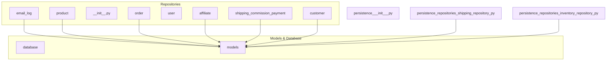

# Level 3: 💾 Persistence Internal Structure

생성일: 2025-12-06 12:38:24

```mermaid
graph TB
    subgraph repos["Repositories"]
        persistence_repositories_email_log_repository_py["email_log"]
        persistence_repositories_product_repository_py["product"]
        persistence_repositories___init___py["__init__.py"]
        persistence_repositories_order_repository_py["order"]
        persistence_repositories_user_repository_py["user"]
        persistence_repositories_affiliate_repository_py["affiliate"]
        persistence_repositories_shipping_commission_payment_repository_py["shipping_commission_payment"]
        persistence_repositories_customer_repository_py["customer"]
    end
    subgraph models["Models & Database"]
        persistence_database_py["database"]
        persistence_models_py["models"]
    end

    persistence_repositories_email_log_repository_py --> persistence_models_py
    persistence_repositories_product_repository_py --> persistence_models_py
    persistence_repositories_order_repository_py --> persistence_models_py
    persistence_repositories_affiliate_repository_py --> persistence_models_py
    persistence_repositories_shipping_commission_payment_repository_py --> persistence_models_py
    persistence_repositories_customer_repository_py --> persistence_models_py
    persistence_repositories_shipping_repository_py --> persistence_models_py
    persistence_repositories_inventory_repository_py --> persistence_models_py

    style persistence_database_py fill:#f4e8ff
    style persistence___init___py fill:#f4e8ff
    style persistence_models_py fill:#f4e8ff
    style persistence_repositories_email_log_repository_py fill:#f4e8ff
    style persistence_repositories_product_repository_py fill:#f4e8ff
    style persistence_repositories___init___py fill:#f4e8ff
    style persistence_repositories_order_repository_py fill:#f4e8ff
    style persistence_repositories_user_repository_py fill:#f4e8ff
    style persistence_repositories_affiliate_repository_py fill:#f4e8ff
    style persistence_repositories_shipping_commission_payment_repository_py fill:#f4e8ff
    style persistence_repositories_customer_repository_py fill:#f4e8ff
    style persistence_repositories_shipping_repository_py fill:#f4e8ff
    style persistence_repositories_inventory_repository_py fill:#f4e8ff
```
