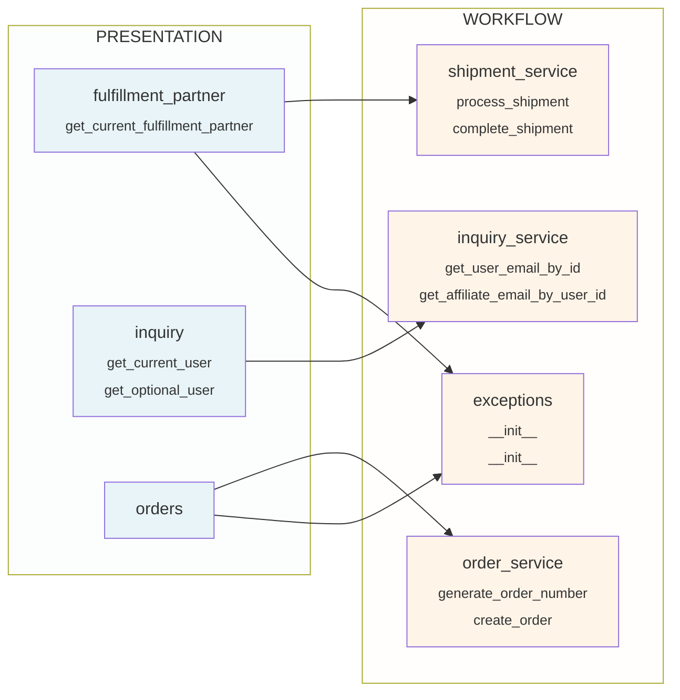

# Level 3: 🎨 Presentation → 💼 Workflow

생성일: 2025-12-06 12:38:24

```mermaid
graph LR

    subgraph src["PRESENTATION"]
        presentation_http_routers_fulfillment_partner_py["fulfillment_partner<br/><sub>get_current_fulfillment_partner</sub>"]
        presentation_http_routers_inquiry_py["inquiry<br/><sub>get_current_user<br/>get_optional_user</sub>"]
        presentation_http_routers_orders_py["orders<br/><sub></sub>"]
    end

    subgraph tgt["WORKFLOW"]
        workflow_exceptions_py["exceptions<br/><sub>__init__<br/>__init__</sub>"]
        workflow_services_inquiry_service_py["inquiry_service<br/><sub>get_user_email_by_id<br/>get_affiliate_email_by_user_id</sub>"]
        workflow_services_order_service_py["order_service<br/><sub>generate_order_number<br/>create_order</sub>"]
        workflow_services_shipment_service_py["shipment_service<br/><sub>process_shipment<br/>complete_shipment</sub>"]
    end

    presentation_http_routers_fulfillment_partner_py --> workflow_services_shipment_service_py
    presentation_http_routers_fulfillment_partner_py --> workflow_exceptions_py
    presentation_http_routers_inquiry_py --> workflow_services_inquiry_service_py
    presentation_http_routers_orders_py --> workflow_services_order_service_py
    presentation_http_routers_orders_py --> workflow_exceptions_py

    style presentation_http_routers_fulfillment_partner_py fill:#e8f4f8
    style presentation_http_routers_inquiry_py fill:#e8f4f8
    style presentation_http_routers_orders_py fill:#e8f4f8
    style workflow_services_inquiry_service_py fill:#fff4e8
    style workflow_services_shipment_service_py fill:#fff4e8
    style workflow_services_order_service_py fill:#fff4e8
    style workflow_exceptions_py fill:#fff4e8
    style src fill:#e8f4f822
    style tgt fill:#fff4e822
```
