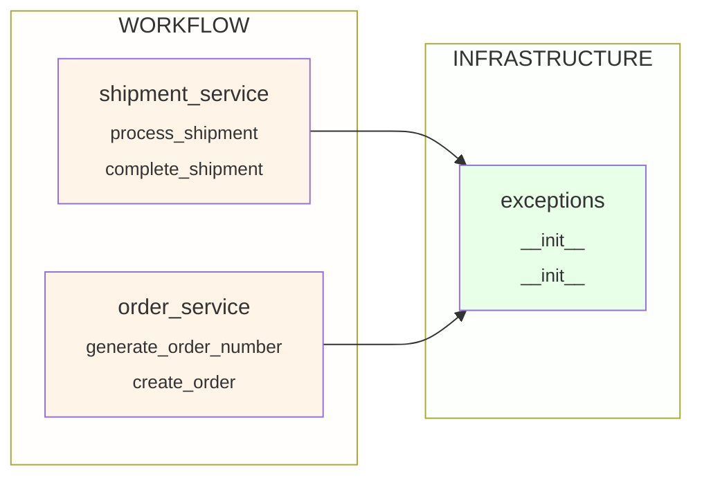

# Level 3: 💼 Workflow → ⚙️ Infrastructure

생성일: 2025-12-06 12:38:24

```mermaid
graph LR

    subgraph src["WORKFLOW"]
        workflow_services_order_service_py["order_service<br/><sub>generate_order_number<br/>create_order</sub>"]
        workflow_services_shipment_service_py["shipment_service<br/><sub>process_shipment<br/>complete_shipment</sub>"]
    end

    subgraph tgt["INFRASTRUCTURE"]
        infrastructure_exceptions_py["exceptions<br/><sub>__init__<br/>__init__</sub>"]
    end

    workflow_services_shipment_service_py --> infrastructure_exceptions_py
    workflow_services_order_service_py --> infrastructure_exceptions_py

    style workflow_services_shipment_service_py fill:#fff4e8
    style workflow_services_order_service_py fill:#fff4e8
    style infrastructure_exceptions_py fill:#e8ffe8
    style src fill:#fff4e822
    style tgt fill:#e8ffe822
```
