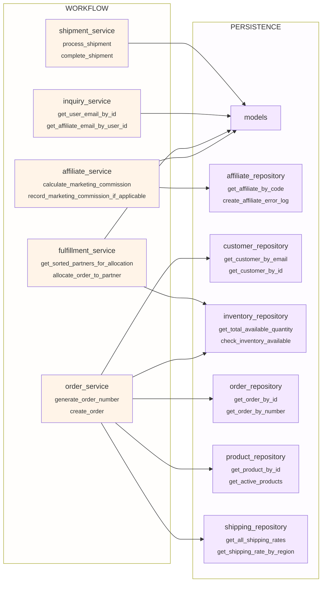

# Level 3: 💼 Workflow → 💾 Persistence

생성일: 2025-12-06 12:38:24

```mermaid
graph LR

    subgraph src["WORKFLOW"]
        workflow_services_affiliate_service_py["affiliate_service<br/><sub>calculate_marketing_commission<br/>record_marketing_commission_if_applicable</sub>"]
        workflow_services_fulfillment_service_py["fulfillment_service<br/><sub>get_sorted_partners_for_allocation<br/>allocate_order_to_partner</sub>"]
        workflow_services_inquiry_service_py["inquiry_service<br/><sub>get_user_email_by_id<br/>get_affiliate_email_by_user_id</sub>"]
        workflow_services_order_service_py["order_service<br/><sub>generate_order_number<br/>create_order</sub>"]
        workflow_services_shipment_service_py["shipment_service<br/><sub>process_shipment<br/>complete_shipment</sub>"]
    end

    subgraph tgt["PERSISTENCE"]
        persistence_models_py["models<br/><sub></sub>"]
        persistence_repositories_affiliate_repository_py["affiliate_repository<br/><sub>get_affiliate_by_code<br/>create_affiliate_error_log</sub>"]
        persistence_repositories_customer_repository_py["customer_repository<br/><sub>get_customer_by_email<br/>get_customer_by_id</sub>"]
        persistence_repositories_inventory_repository_py["inventory_repository<br/><sub>get_total_available_quantity<br/>check_inventory_available</sub>"]
        persistence_repositories_order_repository_py["order_repository<br/><sub>get_order_by_id<br/>get_order_by_number</sub>"]
        persistence_repositories_product_repository_py["product_repository<br/><sub>get_product_by_id<br/>get_active_products</sub>"]
        persistence_repositories_shipping_repository_py["shipping_repository<br/><sub>get_all_shipping_rates<br/>get_shipping_rate_by_region</sub>"]
    end

    workflow_services_affiliate_service_py --> persistence_models_py
    workflow_services_affiliate_service_py --> persistence_repositories_affiliate_repository_py
    workflow_services_order_service_py --> persistence_repositories_order_repository_py
    workflow_services_order_service_py --> persistence_repositories_inventory_repository_py
    workflow_services_order_service_py --> persistence_repositories_shipping_repository_py
    workflow_services_order_service_py --> persistence_repositories_customer_repository_py
    workflow_services_order_service_py --> persistence_repositories_product_repository_py
    workflow_services_fulfillment_service_py --> persistence_models_py
    workflow_services_fulfillment_service_py --> persistence_repositories_inventory_repository_py
    workflow_services_inquiry_service_py --> persistence_models_py
    workflow_services_shipment_service_py --> persistence_models_py

    style workflow_services_affiliate_service_py fill:#fff4e8
    style workflow_services_order_service_py fill:#fff4e8
    style workflow_services_fulfillment_service_py fill:#fff4e8
    style workflow_services_inquiry_service_py fill:#fff4e8
    style workflow_services_shipment_service_py fill:#fff4e8
    style persistence_repositories_order_repository_py fill:#f4e8ff
    style persistence_repositories_inventory_repository_py fill:#f4e8ff
    style persistence_repositories_shipping_repository_py fill:#f4e8ff
    style persistence_repositories_affiliate_repository_py fill:#f4e8ff
    style persistence_models_py fill:#f4e8ff
    style persistence_repositories_customer_repository_py fill:#f4e8ff
    style persistence_repositories_product_repository_py fill:#f4e8ff
    style src fill:#fff4e822
    style tgt fill:#f4e8ff22
```
